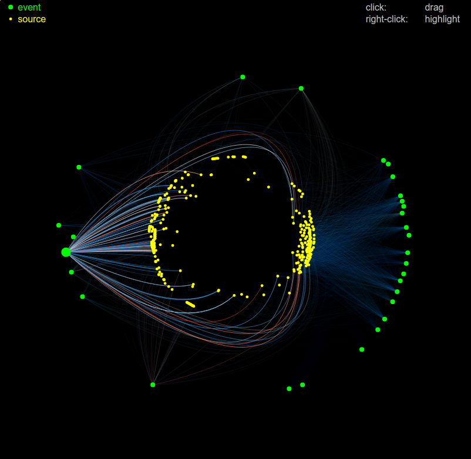

# Prototype

In this prototype, news sources are represented by green dots, while events are represented by yellow points. The links between news sources and events represent articles mentions, and their color correspondond to the tone of the mention (blue is negative and red is positive).

[Click here to see the prototype](processbook/week11/sources_events_graph_prototype/).

# Further work

- We will explore furthur ways of arranging the vertices in space. The idea of having the news sources in an inner circle and the events on an outer circle seems promissing, but we still have to choose how to sort and distribute them exactly.
- We might add labels to news sources and events, either permanently or on click or hover.
- We might add a notion of time: mentions appearing little by little according to when the articles were published for example.

# Previous work

- [Previous version of the graph with sources and mentions](processbook/week10/sources_events_graph_prototype/).
- [Geographic map of average tone per country about a specific subject](processbook/week10/tones_map_prototype/).
- [Very first graph prototype showing only sources](processbook/week09/prototype1).

