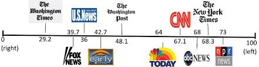
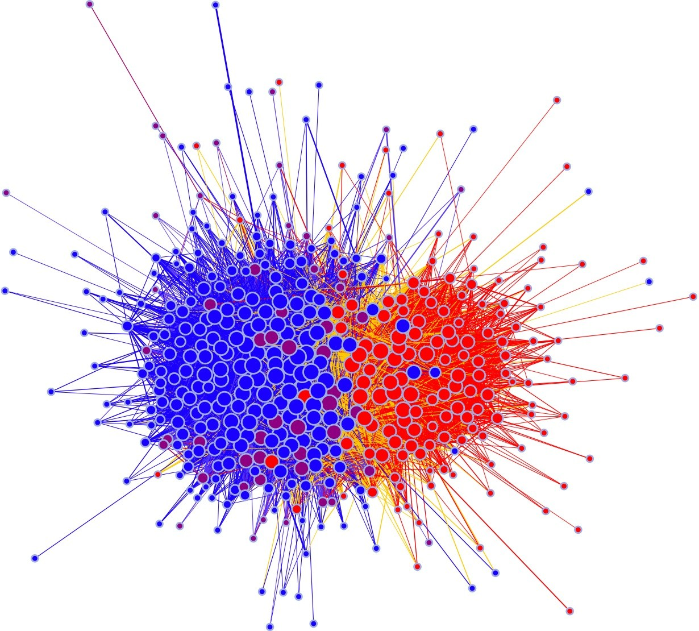
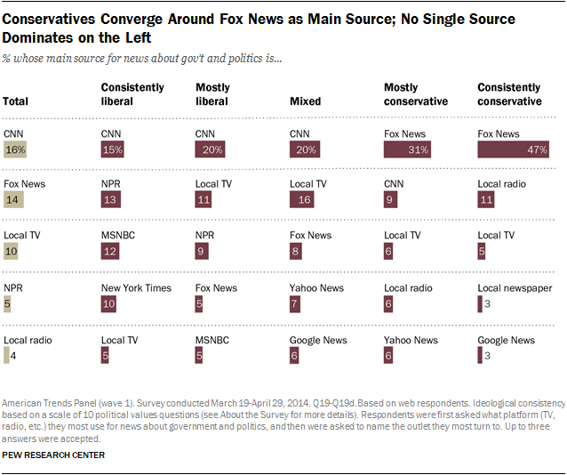
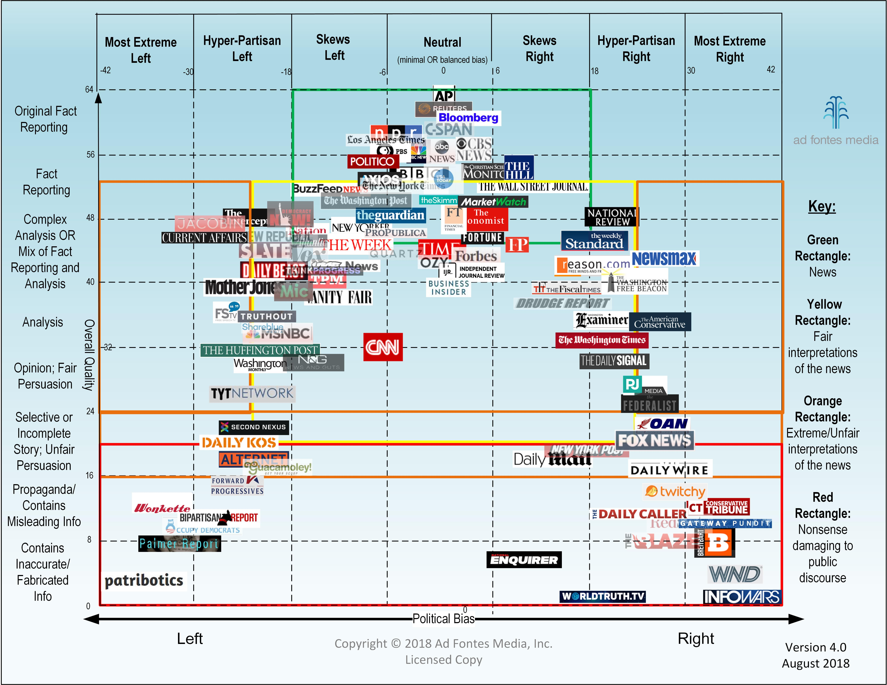
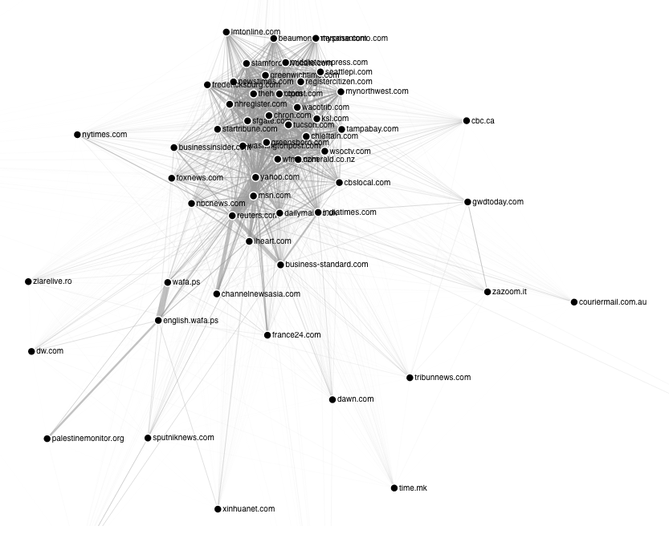
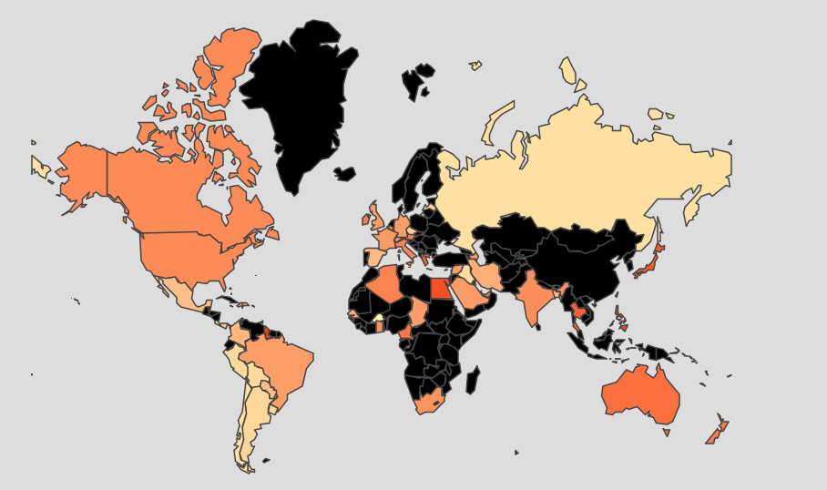
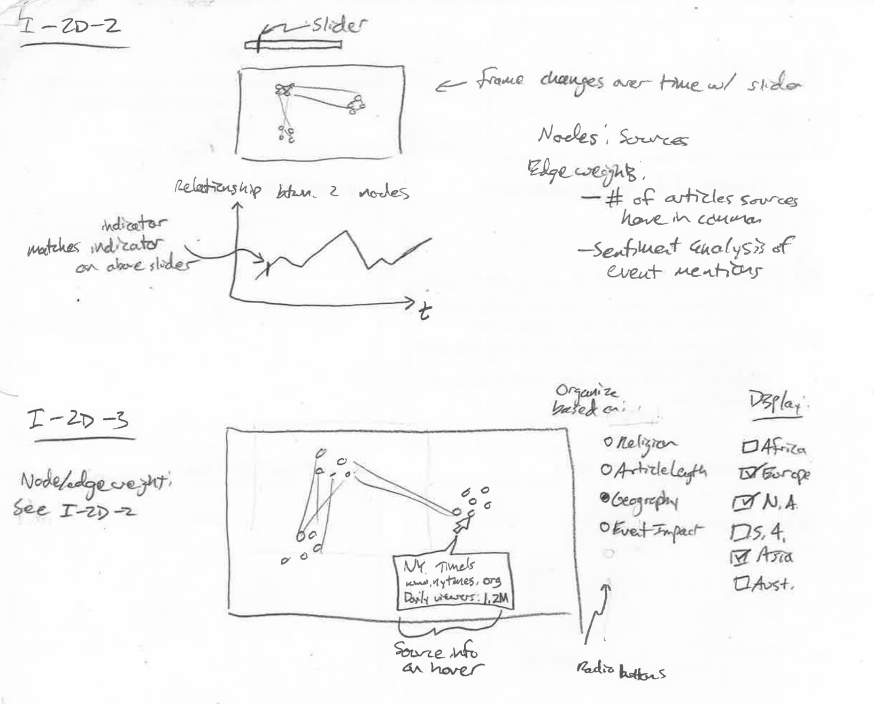
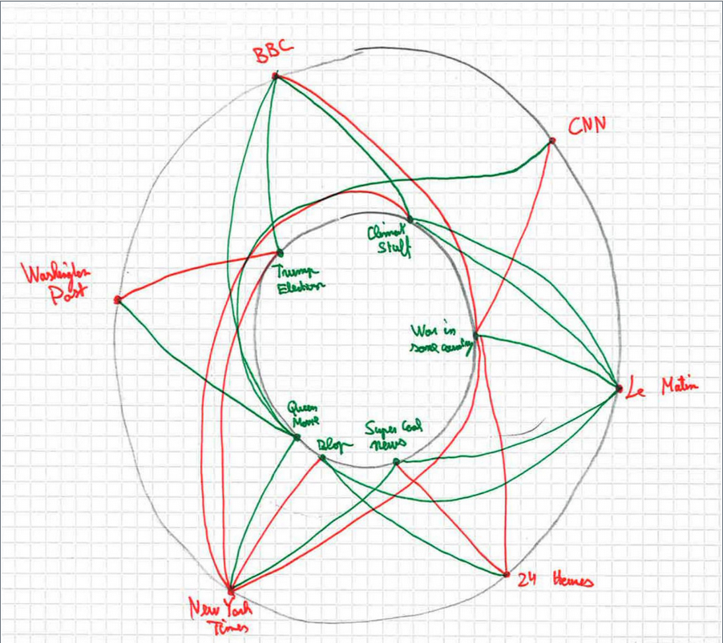
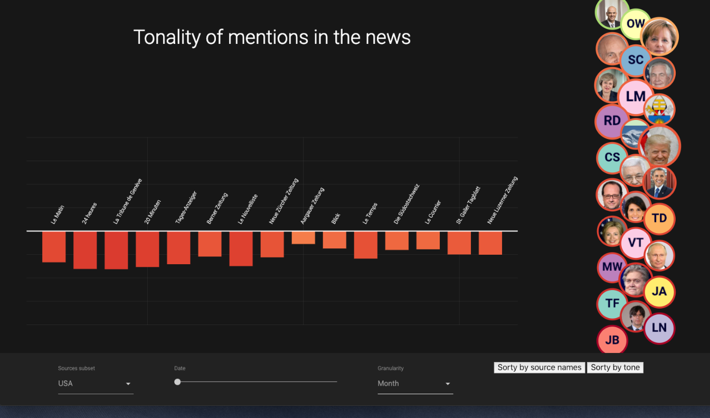

# Processbook
Welcome to the Processbook section of this project! The purpose of this document is to discuss the entire design pipeline of the project and is partitioned accordingly:


1. TOC
{:toc}

- The [**Introduction**](#introduction) section discusses the background, intent, and goals of the project.
- The [**Data**](#data) section discusses the source of the dataset and how we cleaned and wranged the data into a visualizable format. It also discusses initial explorations we completed to view inital underlying patterns in the data.
- The [**Design**](#design) section discusses the prototype iterations that led to our final product as well as the justifications for our design decisions.
- The [**Evaluation**](#evaluation) section discusses the strengths and weaknesses of our visualization and recommendations for future additions.

## Introduction
Logistically, this website and its central visualization comprises the final project for the COM-480: Data Visualization course at Ecole Polytechnique F&eacute;d&eacute;rale de Lausanne (EPFL) in Lausanne, Switzerland. The deeper motivations of the authors are discussed in the [Motivation](#motivation) subsection.

### Overview
[The GDELT Project](https://www.gdeltproject.org/0) is, in short, a consistently-updated database of news articles from around the world. All of the data is publicly-available, as well as numerous (though specific) tools for both extracting subsets and visualizing the data in different ways. While the database has historically been used to to analyze *events* occuring in the world, the primary goal of this project was to create an interactive visualization to explore *sources* of the articles and their characteristics. 

The supervisor for this project was [Dr. Benjamin Ricaud](https://people.epfl.ch/benjamin.ricaud) of EPFL's [LTS2 Signal Processing Lab](https://lts2.epfl.ch/).

### Motivation
News media affects nearly everyone. While some readers use it as casual, relaxing entertainment and others read it actively to learn about the goings-on in the world, all readers use the information they read in the news as a factor in decisioins that they use ranging from simple ("Which brand of tea should I buy?") to extremely important ("Should I vaccinate my child?"). As politics around the world become increasingly polarized, the use of "news" media as persuasion mechanisms rather than objective conveyors of information is unfortunately widespread. 

While accurately quantifying bias is a difficult task, with so much information in the GDELT database (and elsewhere) our team was confident that objectivity indicators could be identified, extracted, and visualized. Drawing from our computer science, engineering, and neuroscience backgrounds, it was our goal to create a tool that enabled users find such information in a way that let them decide in a data-driven way what sources are trustworthy and which are not.

### Target Audience
Our visualization is appropriate and useful for anyone interested in learning about media bias&mdash;specifically, for readers interested in investigating relationships between the news sources and the tonality and frequency with which they discuss certain topics. While the primary audience is consumers that are interested in evaluating the credibility of the news they view, our visualization may also be useful for those studying media bias at the level of academia or public policy.

The goal of the visualization from the users’ perspective revolves largely around discovery (e.g., discovering news sources that are independent and unbiased). While the news is often quite dull and pessimistic, offering some enjoyment to the users as they use our visualization would likely motivate them to seek out the new sources they discover as well. 

### Inspiration and Related Work

The concept of biased media is not a new topic, and therefore, neither is visualizing it. It's not difficult to find many attempts to visualize news bias. However, nearly all of them have significant problems, particularly for the common user.

Many scales mapping sources to their bias exist, but they are often cluttered and fail to easily convey how these mappings were calculated (if at all). Notice in Figure 1 that the *left*-leaning sources are on the *right*-hand side of the visualization and vice versa ([Figure 1 Source](https://www.aaai.org/ocs/index.php/ICWSM/ICWSM12/paper/download/4775/5075)):

<br/>
<center>Figure 1. Backwards Bias Scale.</center>

Figure 2 shows an example of a cluttered, non-interactive graph visualization. Our sponsor strongly suggested a graph visualization, and current work such as Figure 2 suggests that there is a need for clear, descriptive graph visualizations in this subject area ([Figure 2 Source](http://blog.logicalrealism.org/2008/12/09/visualizing-political-blogs-linking/)):


<center>Figure 2. Graph of Political Blogs.</center>


Many visualizations such as those in Figure 3 were survey-based and showed results of peoples' *perception* of bias but failed to convey objective information about the sources that could justify labelling a source as biased or not ([Figure 3 Source](http://www.journalism.org/2014/10/21/section-1-media-sources-distinct-favorites-emerge-on-the-left-and-right/)):


<center>Figure 3. Survey-Based Visualization.</center>

Even more descriptive and clear visualizations have failed to provide interactivity. Charts such as those in Figure 4 (similar to Figure 1) simply state what sources are biased without clearly showing the reader how. This lack of interactivity means that the viewer is limited to the authors' conclusions and unable to develop any additional conclusions on her or his own ([Figure 4 Source](https://www.adfontesmedia.com/)): 


<center>Figure 4. Media Bias Chart.</center>

We drew most of our inspiration on interactivity from examples with simple, clean, clear interactivity from an extensive [d3 gallery on github](https://github.com/d3/d3/wiki/Gallery). Here are some examples:
- Graphs
  - [Force-Directed Graph](https://bl.ocks.org/heybignick/3faf257bbbbc7743bb72310d03b86ee8)
  - [Collapsible Force Layout](http://mbostock.github.io/d3/talk/20111116/force-collapsible.html)
  - [Hive Plots](https://bost.ocks.org/mike/hive/)
- Bar & Area Charts
  - [Simple Dynamic Bar Chart](https://bl.ocks.org/jalapic/acb4b8b6523e73394c86/454da2974578bcc9b4bb4090cf005cd2fa1a3ef6)
  - [Bubble Chart](https://beta.observablehq.com/@mbostock/d3-bubble-chart)
  - [Obama's Budget Proposal](https://archive.nytimes.com/www.nytimes.com/interactive/2012/02/13/us/politics/2013-budget-proposal-graphic.html)


## Data
This section provides detail about the dataset, how we accessed it, how we aggregated it and cleaned it into a presentable format. 

### Description of the Dataset
As mentioned in the [Overview](#overview), our data comes from the GDELT project, which is an acronym for the Global Database of Events, Language, and Tone. Here is how the project describes it's own datasets ([source](https://www.gdeltproject.org/data.html)):

>The GDELT Project is the largest, most comprehensive, and highest resolution open database of human society ever created. Just the 2015 data alone records nearly three quarters of a trillion emotional snapshots and more than 1.5 billion location references, while its total archives span more than 215 years, making it one of the largest open-access spatio-temporal datasets in existance and pushing the boundaries of "big data" study of global human society. Its Global Knowledge Graph connects the world's people, organizations, locations, themes, counts, images and emotions into a single holistic network over the entire planet.

While the data in its rawest form is available in large zipped files, a more structured version of the it is hosted on the Google Cloud Platform in the form of several tables each with about 500 million rows. These tables are accessble via [Google BigQuery](https://cloudplatform.googleblog.com/2014/05/worlds-largest-event-dataset-now-publicly-available-in-google-bigquery.html). 

We primarily used two of the tables in the dataset: the "Events" table, which provides information about the actors in the event and the number of times that event was mentioned; and the "Eventmentionds" table, which provides information about the source of the mention, the tone of the mention, and descriptors about the document in which the mention was nested.

### Exploratory Data Analysis
Over the course of the project we used a mixture of SQL-like queries to the Google BigQuery database, bash files, python scripts, and visualizations to explore the data, view preliminary underlying structures and patterns, and decide how to choose how to filter and aggregate the large dataset into one that would more directly lead to meaningful conclusions. While the GDELT project offers many tools such as a simple export-to-email service and several visualization tools, accessing the BigQuery database directly was the only way to achieve the flexbility necessary for a full interactive visualization. 

For example, below is an example of a query to fetch information by geographic region when building our [global map prototype](https://github.com/mbovel/dataviz-project/tree/master/processbook/week10/tones_map_prototype):

```sql
SELECT
  AVG(CAST((SPLIT(V2Tone)[OFFSET(0)]) AS FLOAT64)) AS avg,
  STDDEV(CAST((SPLIT(V2Tone)[OFFSET(0)]) AS FLOAT64)) AS std,
  COUNT(*) AS count,
  geo.CountryName,
  geo.FIPS
FROM
  `gdelt-bq.gdeltv2.gkg_partitioned`,
  `gdelt-bq.extra.sourcesbycountry` geo
WHERE
  _PARTITIONTIME >= TIMESTAMP('2018-10-28')
  AND _PARTITIONTIME < TIMESTAMP('2018-11-10')
  AND 'Jair Bolsonaro' IN (
  SELECT
    REGEXP_REPLACE(person, r',.*', '')
  FROM
    UNNEST(SPLIT(V2Persons,';')) AS person)
  AND SourceCommonName = geo.Domain
GROUP BY
  geo.CountryName, geo.FIPS
HAVING
  count > 5
  AND std < 3.0
ORDER BY avg
```

To see an example bash script, [click](https://github.com/mbovel/dataviz-project/tree/master/processbook/week10/sources_events_graph_prototype), for an example of one of our earlier prototypes, where we selected and formatted only the news sources and events that have several instances in the database (i.e., are considered to be largest, most discussed, etc.):

We were able to see several insights simply from filtering the data, as well as the metadata provided by the GDELT project both on their website and on Google BigQuery. For reasons we discuss more in-depth in the [Design](#design) section, we originally were confident that our main visualization would be either a geographical map or a graph visualization. Early visualizations in both of these styles also provided important insight into what kinds of demonstrations of the data would be useful for telling stories. 

Figure 5 shows the very first visualization we created. It was an undirected force-directed graph for a certain day where the nodes were news sources and and the edges were the number of events that both sources had discussed. For example, if both the BBC and The Times discussed 40 events, then the weight of the edge between them was 40. ([Click here for a link to the source code](https://github.com/mbovel/dataviz-project/tree/master/processbook/week09)) 


<center>Figure 5. First Force-Directed Graph Prototype.</center>

We had hoped that clusters would emerge of sources discussing the same topics, providing us with information about the similarities of sources, but this was clearly not the case 

Another example of early visualizations we used to see data trends was a geographical map where the color of the countries corresponded to the average tone of the media in that country for a certain event, seen in Figure 6. This particular example shows the responses of countries to the election of the right-wing politician Jair Bolsonaro in Brasil ([source code](https://github.com/mbovel/dataviz-project/tree/master/processbook/week10/tones_map_prototype)):


<center>Figure 6. Map of Tones of Media for Single Events.</center>

While these were very much rough visualizations, they did provide us with visual examples of how we would need to modify certain visualizations if we wanted them to be effective tools. 

## Design
In this section we discuss the several aesthetic and functional iterations which led us to the current version of our visualization.
### Ideation, Sketching and Prototyping
The primary research questions posed by the supervising lab were as follows:
>A network of news sites can be made to get a better picture of how much they share the same information. News that report the same events would be linked in the network. The connection weights would increase as the number of shared news increases. Can we make some interesting and clean visualizations of the news sites landscape? Can we categorize them? Are there news sites that are more central? Do we get different networks if we take into account news related to particular topics? Can we combine additional info present in the data with the graph to get additional insights?

In short, the obvious choice for representing weighted relationships between multiple news sources based on some metric was either a graph, or a geographic map (which is essentially a graph visualization with more restrictions on spatial variables). 

The sketch below shows an early idea for the shaded map displayed at the end of the [Exploratory Data Analyses subsection](#exploratory-data-analysis)


<center>Figure 7. Sketch of Tone Map.</center>

Additionally, the following sketches display clusters that we predicted would emerge as well as some early UI ideas:


<center>Figure 8. Early Graph and UI Sketches.</center>

We knew we wanted to visualize the relationships between news sources based on some metric. The two main ideas we considered for the metric were:
- The number of articles two sources both discussed
  - This proved to be a poor metric as the result was the black-and-white all-connected graph in the [Exploratory Data Analysis section](#exploratory-data-analysis)
- The sentiment of the mentions which with sources discussed certain topics
  - This proved much more interesting both from a visualization perspective and because sentiment is a trait that even users without quantitative backgrounds could connect with.

After deciding to visualize sentiment, the next important question was how to subset the news sources into a number that we could visualize effectively. We knew we wanted to organize news sources by geographic region to be useful to as wide as a user base as possible. We attempted to organize the sources by geographic region by using an online mapping of the news sources to their location ([link to this mapping here](https://blog.gdeltproject.org/mapping-the-media-a-geographic-lookup-of-gdelts-sources/)) but this proved inaccurate, as the country assignments were based on the most common country referenced in the articles, resulting in international publishers such as Al Jazeera being allocated to incorrect countries. We also attempted automatically scraping online lists of sources from Wikipedia, but unfortunately, for some countries, only one or two sources were available ([click here](https://github.com/mbovel/dataviz-project/blob/028296a6dd00f4d8aff15d695eedeff00968a88b/scripts/generate_sources.py) to see the code we used for the Wikipedia scraping). Ultimately, we decided to manually create a short list of sources based on website traffic (using sources such as [this one](http://mediashift.org/2018/01/nine-insights-right-wing-website-traffic/)) and ensuring that for each region we used sources that represented the entire political spectrum. Having a static list of sources for each view also enables users to more easily compare them, versus having a dynamic list of sources that users would quickly forget as they left the screen. 

After using only sources as nodes failed to result in clusters, we attempted using both sources and subjects as nodes, as in the following sketch. Note that the best indicator for subjects based on the structure of the available data is the *people* described in the articles.


<center>Figure 8. Early Graph and UI Sketches.</center>

Using various interactivity such as highlighting all connected edges when clicking on a specific node, we reasoned, would indicate what sources talked negatively about particular subjects, and the ability to compare sources based on how they talked about a certain topic if a specific topic was selected. While we were able to generate very aesthetically-pleasing visualizations, unfortunately these were still too to draw meaningful conclusions. 

After failing to successfully visualize a graph, we translated the encodings into a new layout that is described in the next section. 

### Final Visualization
A screenshot of the final layout is below:


<center>Figure 10. Final Visualization.</center>

The most important interactions are as follows:
- The "sources subset" selection menu in the bottom-left allows the user to select which region of data they wish to view. Currently the only available sets are USA and Switzerland but additional areas could easily be added in the future.
- After choosing the granularity (aggregations over a day, a month, or a year) in the "Granularity" drop-down menu, the slider allows users to choose which date, month, or year that they are viewing. 
- The sort buttons on the bottom-right allow users to sort the bar charts based on the tone or by the name of the source.
- The bubble chart on the right shows the people that are discussed in the news articles. The size of the bubble corresponds to the number of articles that discuss each person, while the color of the border around the person corresponds to the tonality of the person. 
- Upon selecting a person, the bar chart shows the tonality of mentions for the specific source. Hovering over the bars highlights the individual bar, while clicking on it opens the website source in a new tab.
### Technical Implementation
This website was implemented using the [Jekyll framework](https://jekyllrb.com/) and hosted with [Github pages](https://pages.github.com/). The visualizations were created entirely with [D3](https://d3js.org/), and the UI was written using Google's [Materialize framework](https://materializecss.com/).

The final data scraping and organization scripts were written in Python, Particularly for the following uses:
- Scraping Wikipedia to include images of the people. 
- While we intended to only showcase media sources' discussion of people, many subjects in the GDELT database contained names of cities and misspelled words.
  - To correct misspelled names, we compared subjects with the [Pantheon Database](http://pantheon.media.mit.edu/treemap/country_exports/RU/all/-4000/2010/H15/pantheon) and only retained subjects with a [Levenshtein distance](https://en.wikipedia.org/wiki/Levenshtein_distance) of 2 from the names in the Pantheon dataset. We also implemented caching so that the names in the articles we found would not need to be repeatedly found in the Pantheon dataset with 2,000,000+ records.
  - To remove cities, we ensured that the subjects we found were not in the [World Cities Database](https://simplemaps.com/data/world-cities).

We intentionally chose not to Webpack or bundle due to the lack of necessity for it in when using HTTP2. Follow [this link](https://stackoverflow.com/questions/30861591/why-bundle-optimizations-are-no-longer-a-concern-in-http-2/30862010#30862010) for more information on this reasoning. 

## Evaluation
### Individual Contributions
Each us comes from a different academic background, which enabled us to take ownership of different parts of the project as follows with equal value to the group as a whole:
- **Matthieu** has an extremely strong background in computer science and software development. In addition to contributing consistently to the development of the visualization code, he took charge of organizing the infrastructure of the website, including selecting Jekyll of the framework, setting up the hosting of this site using Github Pages, and overseeing the repo as a whole including issue management and pull requests.
- As a neuroscience PhD candidate, **Ruslan** had a valuable scientific computing and data analysis skillset. He contributed signifantly to cleaning and aggregating the data, coding the core of the visualizations, and exploring a variety of prototypes, including [this biclustering example](https://github.com/mbovel/dataviz-project/tree/master/processbook/week12/biclustering).
- **Daniel**'s background in mechanical engineering enabled him to lead the design process and overall group organization. He ensured the design process was structured, maintained contact with the supervisors, maintained group direction towards important deadlines and milestones, created most of the website content such as the Home, Team, and Data pages, and developed most of this report.
### Future Work
The part of our visualization with the most potential for improvement is the initial user experience. Specific features that would add user engagement include a tutorial-like sequence of fade-outs to guide the user to the main controls of the visualization. 
