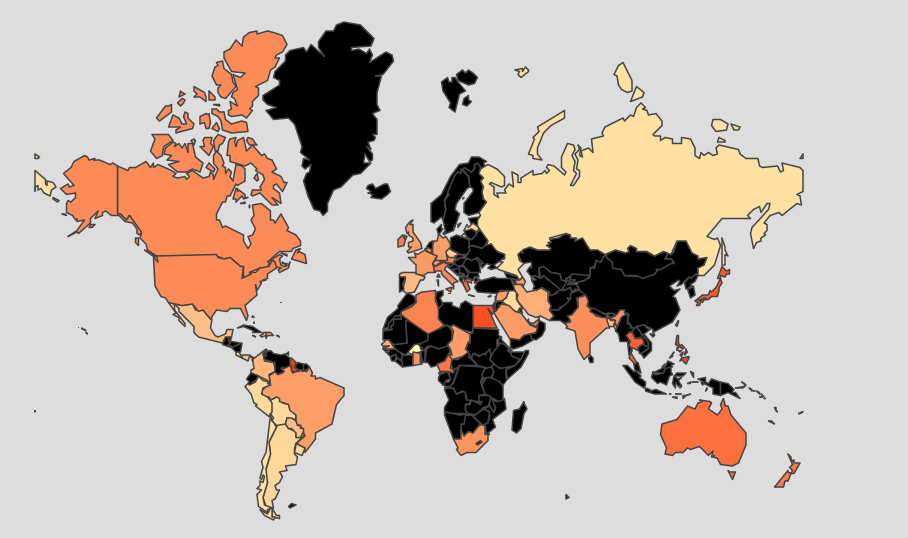

# Processbook
Welcome to the Processbook section of this project! The purpose of this processbook is to discuss the entire design pipeline of the project and is partitioned accordingly:

[TODO: Insert nav/table of contents here. If you want I can make section references with a list here in the same way that I have used section references elsewhere in the file, but I opted against in in case you wanted to use a code structure more like [this one](https://jekyllrb.com/tutorials/navigation/#scenario-3-two-level-navigation-list)]<br/>
[TODO: Make sure subsection linking works. The syntax I used is based on this answer:]
[TODO: In the "Inspiration and Related Work" section, do you think we need to add more information about aesthetic motivations (for example, the data art on Kirell's website)? In the "inspiration" section of the example processbook on Moodle, there is a picture of Lake Geneva and the surrounding mountains that the team said they used as inspiration for the "Landscape" theme. Do we have anything as artistic or abstract as that?]
[TODO: In the "Exploratory Data Analysis" Section, I don't really understand the structure of the Global Knowledge Graph. If we are using that, I would appreciate if one of you could add to that section.]


The [**Introduction**](#introduction) section discusses the background, intent, and goals of the project.
The [**Data**](#data) section discusses the source of the dataset and how we cleaned and wranged the data into a visualizable format. It also discusses initial explorations we completed to view inital underlying patterns in the data.
The [**Design**](#design) section discusses the prototype iterations that led to our final product as well as the justifications for our design decisions.
The [**Evaluation**](#evaluation) section discusses the strengths and weaknesses of our visualization and recommendations for future additions.

## Introduction
Logistically, this website and the central visualization comprises the final project for the COM-480: Data Visualization course at Ecole Polytechnique F&eacute;d&eacute;rale de Lausanne (EPFL) in Lausanne, Switzerland. The deeper motivations of the authors are discussed in the [Motivation](#motivation) subsection.

### Overview
[The GDELT Project](https://www.gdeltproject.org/0) is, in short, a consistently-updated database of news articles from around the world. All of the data is publicly-available, as well as numerous (though specific) tools for both extracting subsets and visualizing the data in different ways. While the database has historically been used to to analyze *events* occuring in the world, the primary goal of this project was to create an interactive visualization to explore *sources* of the articles and their characteristics. 

The sponsor for this project was [Dr. Benjamin Ricaud](https://people.epfl.ch/benjamin.ricaud) of EPFL's [LTS2 Signal Processing Lab](https://lts2.epfl.ch/).

### Motivation
News media affects nearly everyone. While some readers use it as casual, relaxing entertainment and others read it actively to learn about the goings-on in the world, all readers use the information they read in the news as a factor in decisioins that they use ranging from simple ("Which brand of tea should I buy?") to extremely important ("Should I vaccinate my child?"). As politics around the world become increasingly polarized, the use of "news" media as persuasion mechanisms rather than objective conveyors of information is unfortunately widespread. 

While accurately quantifying bias is a difficult task, with so much information in the GDELT database (and elsewhere) our team was confident that objectivity indicators could be identified, extracted, and visualized. Drawing from our computer science, engineering, and neuroscience backgrounds, it was our goal to create a tool that let users do just that in a way that let them decide in a data-driven way what sources are trustworthy and which are not.

### Target Audience
Our visualization is appropriate and useful for anyone interested in learning about media bias. While the primary audience is consumers that are interested in evaluating the credibility of the news they view, our visualization may also be useful for those studying media bias at the level of academia or public policy.

The goal of the visualization from the users’ perspective revolves largely around discovery (e.g., discovering news sources that are independent and unbiased). While the news is often quite dull and pessimistic, offering some enjoyment to the users as they use our visualization would likely motivate them to seek out the new sources they discover as well. 

### Inspiration and Related Work

The concept of biased media is not a new topic, and therefore, neither is visualizing it. It's not difficult to find many attempts to visualize news bias. However, nearly all of them have significant problems, particularly for the common user.

Many scales mapping sources to their bias exist, but they are often cluttered and fail to easily convey how these mappings were calculated (if at all). Notice in Figure 1 that the *left*-leaning sources are on the *right*-hand side of the visualization and vice versa ([Figure 1 Source](https://www.aaai.org/ocs/index.php/ICWSM/ICWSM12/paper/download/4775/5075)):

<br/>
<center>Figure 1. Backwards Bias Scale.</center>

Figure 2 shows an example of a cluttered, non-interactive graph visualization. Our sponsor strongly suggested a graph visualization, and current work such as Figure 2 suggests that there is a need for clear, descriptive graph visualizations in this subject area ([Figure 2 Source](http://blog.logicalrealism.org/2008/12/09/visualizing-political-blogs-linking/)):


<center>Figure 2. Graph of Political Blogs.</center>


Many visualizations such as those in Figure 3 were survey-based and showed results of peoples' *perception* of bias but failed to convey objective information about the sources that could justify labelling a source as biased or not ([Figure 3 Source](http://www.journalism.org/2014/10/21/section-1-media-sources-distinct-favorites-emerge-on-the-left-and-right/)):


<center>Figure 3. Survey-Based Visualization.</center>

Even more descriptive and clear visualizations have failed to provide interactivity. Charts such as those in Figure 4 (similar to Figure 1) simply state what sources are biased without clearly showing the reader how. This lack of interactivity means that the viewer is limited to the authors' conclusions and unable to develop any additional conclusions on her or his own ([Figure 4 Source](https://www.adfontesmedia.com/)): 


<center>Figure 4. Media Bias Chart.</center>

We drew most of our inspiration on interactivity from examples with simple, clean, clear interactivity from an extensive [d3 gallery on github](https://github.com/d3/d3/wiki/Gallery). Here are some examples:
* [Force-Directed Graph](https://bl.ocks.org/heybignick/3faf257bbbbc7743bb72310d03b86ee8)
* [Collapsible Force Layout](http://mbostock.github.io/d3/talk/20111116/force-collapsible.html)
* [Hive Plots](https://bost.ocks.org/mike/hive/)

Note that, as we describe in the [Design](#design) section, we decided early in the design process that a graph/network visualization would be the most effective way of achieving our goals.

## Data
This section provides detail about the dataset, how we accessed it, how we aggregated it and cleaned it into a presentable format. 

### Description of the Dataset
As mentioned in the [Overview](#overview), our data comes from the GDELT project, which is an acronym for the Global Database of Events, Language, and Tone. Here is how the project describes it's own datasets ([source](https://www.gdeltproject.org/data.html)):

>The GDELT Project is the largest, most comprehensive, and highest resolution open database of human society ever created. Just the 2015 data alone records nearly three quarters of a trillion emotional snapshots and more than 1.5 billion location references, while its total archives span more than 215 years, making it one of the largest open-access spatio-temporal datasets in existance and pushing the boundaries of "big data" study of global human society. Its Global Knowledge Graph connects the world's people, organizations, locations, themes, counts, images and emotions into a single holistic network over the entire planet.

While the data in its rawest form is available in large zipped files, a cleaner (but still large) version of the dataset is hosted on the Google Cloud Platform in the form of several tables each with about 500 million rows. These tables are accessble via [Google BigQuery](https://cloudplatform.googleblog.com/2014/05/worlds-largest-event-dataset-now-publicly-available-in-google-bigquery.html). 

We primarily used two of the tables in the dataset: the "Events" table, which provides information about the actors in the event and the number of times that event was mentioned; and the "Eventmentionds" table, which provides information about the source of the mention, the tone of the mention, and descriptors about the document in which the mention was nested.

### Exploratory Data Analysis
Over the course of the project we used a mixture of SQL-like queries to the Google BigQuery database, bash files, and visualizations to explore the data, view preliminary underlying structures and patterns, and decide how to choose how to filter and aggregate the large dataset into one that would more directly lead to meaningful conclusions. While the GDELT project offers many tools such as a simple export-to-email service and several visualization tools, accessing the BigQuery database directly was the only way to achieve the flexbility necessary for a full interactive visualization. 

For example, below is an example of a query to fetch information by geographic region when building our [global map prototype](https://github.com/mbovel/dataviz-project/tree/master/processbook/week10/tones_map_prototype):

```sql
SELECT
  AVG(CAST((SPLIT(V2Tone)[OFFSET(0)]) AS FLOAT64)) AS avg,
  STDDEV(CAST((SPLIT(V2Tone)[OFFSET(0)]) AS FLOAT64)) AS std,
  COUNT(*) AS count,
  geo.CountryName,
  geo.FIPS
FROM
  `gdelt-bq.gdeltv2.gkg_partitioned`,
  `gdelt-bq.extra.sourcesbycountry` geo
WHERE
  _PARTITIONTIME >= TIMESTAMP('2018-10-28')
  AND _PARTITIONTIME < TIMESTAMP('2018-11-10')
  AND 'Jair Bolsonaro' IN (
  SELECT
    REGEXP_REPLACE(person, r',.*', '')
  FROM
    UNNEST(SPLIT(V2Persons,';')) AS person)
  AND SourceCommonName = geo.Domain
GROUP BY
  geo.CountryName, geo.FIPS
HAVING
  count > 5
  AND std < 3.0
ORDER BY avg
```

When the SQL syntax became too complicated, we used other filtering methods such as the bash script below. This script comes from [one of our earlier prototypes](https://github.com/mbovel/dataviz-project/tree/master/processbook/week10/sources_events_graph_prototype), where we selected and formatted only the news sources and events that have many several instances in the database (i.e., are considered to be largest, most discussed, etc.):

```bash
#!/bin/bash


cat eventmentions_20181119_1.csv |
	awk -F, '{print $1}' |
	sort -n | uniq -c | sort -n |
	awk '$1 > 300 {print $2}' > EvID_above300_counts.csv

cat eventmentions_20181119_1.csv |
	awk -F, '{print $2}' |
	sort -n | uniq -c | sort -n |
	awk '$1 > 200 {print $2}' > SourceID_above200_counts.csv

head eventmentions_20181119_1.csv -n 1 > eventmentions_20181119_1_filtered.csv

for i in `cat EvID_above300_counts.csv`
do
	cat eventmentions_20181119_1.csv |
	awk -F, -v evid=$i '$1 == evid {print}' >> \
	eventmentions_20181119_1_filtered.csv.tmp
done

for j in `cat SourceID_above200_counts.csv`
do
	cat eventmentions_20181119_1_filtered.csv.tmp |
	awk -F, -v sid=$j '$2 == sid {print}' >> \
	eventmentions_20181119_1_filtered.csv.tmp2
done

cat eventmentions_20181119_1_filtered.csv.tmp2 | sort | uniq >> eventmentions_20181119_1_filtered.csv

rm eventmentions_20181119_1_filtered.csv.tmp
rm eventmentions_20181119_1_filtered.csv.tmp2
```

We were able to see several insights simply from filtering the data, as well as the metadata provided by the GDELT project both on their website and on Google BigQuery. [TODO: @matthieu, I know this is something you had talked about but I don't understand it very well so it would be very helpful if you could add it!]. For reasons we discuss more in-depth in the [Design](#design) section, we decided early on that our main visualization would be either a geographical map or a graph visualization. Early visualizations in both of these styles also provided important insight into what kinds of demonstrations of the data would be useful for telling stories. 

Figure 5 shows the very first visualization we created. It was an undirected force-directed graph for a certain day where the nodes were news sources and and the edges were the number of events that both sources had discussed. For example, if both the BBC and The Times discussed 40 events, then the weight of the edge between them was 40. ([Click here for a link to the source code](https://github.com/mbovel/dataviz-project/tree/master/processbook/week09)) 


<center>Figure 5. First Force-Directed Graph Prototype.</center>

We had hoped that clusters would emerge of sources discussing the same topics, providing us with information about the similarities of sources, but this was clearly not the case 

Another example of early visualizations we used to see data trends was a geographical map where the color of the countries corresponded to the average tone of the media in that country for a certain event, seen in Figure 6. This particular example shows the responses of countries to the election of the right-wing politician Jair Bolsonaro in Brasil ([source code](https://github.com/mbovel/dataviz-project/tree/master/processbook/week10/tones_map_prototype)):


<center>Figure 6. Map of Tones of Media for Single Events</center>

While these were very much rough visualizations, they did provide us with visual examples of how we would need to modify certain visualizations if we wanted them to be effective tools. 
## Design
### Ideation and Sketching
### Prototyping
### Final Implementation
## Evaluation
