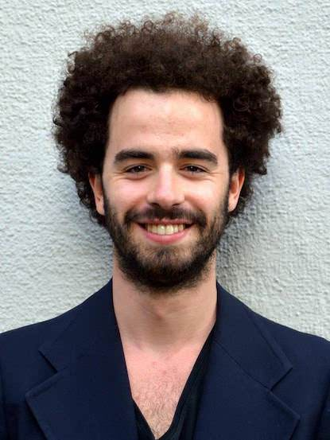

# Team

We're a team of 3 students at [Ecole Polytechnique F&eacute;d&eacute;rale de Lausanne (EPFL)](https://www.epfl.ch/en/home/) in Lausanne, Switzerland. We all love data and dataviz, but we also each have our own unique perks -- read more about them below.

## Daniel Smarda

{: class="left"}

I am studying an MSc in Data Science and I am on track to graduate in July 2020. My interests are diverse, encompassing statistics, computer science, social work, global development, and engineering, including a BS in Mechanical Engineering from [The University of Texas at Austin (USA)](https://www.utexas.edu/). My passion is merging the domains of artificial intelligence, data science, social science, and public policy to learn more about the world and help people who need it most. 

## Matthieu Bovel

{: class="left"}

After hesitating for a long time between becoming a professional trapeze artist or a software engineer, I chose the latter and I'm now pursing a Masters Degree in Computer Science at EPFL. In my studies, I'm mainly interested in programming languages, web technologies and data analysis.

## Ruslan Aydarkhanov

{: class="left"}

A PhD candidate in the field of Brain-Computer Interaction. Being torn between my interests in computer science and biology, I have never made a choice. My PhD project is focused on interpreting electrical signals from human brain, which will allow direct user communication with machines in the future.
